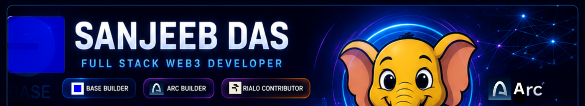

  

<h1 align="center">Hi 👋, I'm Sanjeeb Das</h1>

<h3 align="center">
  Full Stack Web3 Developer from India 🇮🇳
</h3>

  

  

---

## 🚀 About Me

- 🟦 Building innovative consumer applications on **Base**
- ⚡ Building decentralized applications on **Arc Testnet**
- 🔥 Exploring and contributing to the **Rialo ecosystem**
- 💻 Working with **Next.js, React, TypeScript, Tailwind CSS and Solidity**
- 🧠 Learning more about **smart contracts, AI and open-source infrastructure**
- 🌍 Based in **India**
- 💙 Passionate about transforming ideas into useful applications

---

## 🛰️ Featured Projects

<table>
<tr>
<td width="50%" valign="top">

### 🟦 Base Orbit

A fast-paced, one-thumb arcade game built around the Base ecosystem.

**Highlights**

- Base Mainnet wallet integration
- Daily onchain activation
- Block-inspired arcade gameplay
- Streak and leaderboard experience

  

</td>

<td width="50%" valign="top">

### 📈 Prederc Forecast Arena

A testnet BTC forecasting simulator built with Next.js and live market data.

**Highlights**

- Live BTC price feed
- Higher-or-lower forecasting
- Candlestick chart
- Demo points and performance history

  
  

</td>
</tr>
</table>

### 🔥 Rialo Exploration and Contributions

Studying Rialo architecture, examples, documentation and open-source contribution opportunities.

  

---

## 🛠️ Tech Stack

  

  
  
  
  

---

## 📊 GitHub Stats

  
  

  

---

## 📈 Contribution Activity

  

---

## 🏆 GitHub Trophies

  

---

## 🐍 Contribution Snake

  <picture>
    <source
      media="(prefers-color-scheme: dark)"
      srcset="https://raw.githubusercontent.com/sanjeebdas1979/sanjeebdas1979/output/github-contribution-grid-snake-dark.svg"
    />
    <source
      media="(prefers-color-scheme: light)"
      srcset="https://raw.githubusercontent.com/sanjeebdas1979/sanjeebdas1979/output/github-contribution-grid-snake.svg"
    />
    
  </picture>

---

## 🤝 Connect With Me

---

  <strong>💙 Building the Onchain Future</strong>

  Made with ❤️ by Sanjeeb Das

